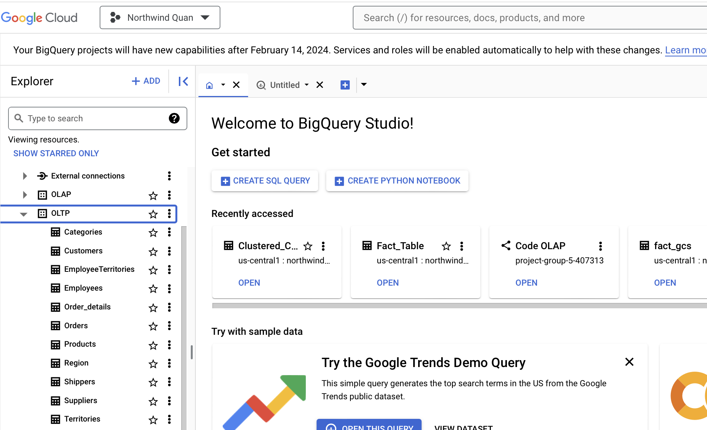
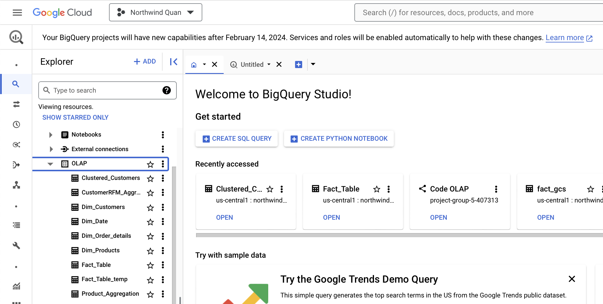

# DataWarehouse-practice
Welcome to my repositpry for Data Warehouse practice.

**This repository contains the following services:**

- **GCP**: Google Cloud Platform (GCP) is a suite of cloud computing services by Google, offering infrastructure, platform, and software solutions for building and scaling applications.

- **Apache_Nifi**: Apache NiFi is a dataflow automation tool for moving and transforming data visually.

- **Apache_Airflow**: Apache Airflow is a platform for programmatically scheduling and monitoring workflows using Python code

**Goal of this repositpry:**

This repository aims to familiarize tools such as Google Cloud Platform(GCP), Apache Nifi, and Apache Airflow, and creating a complete ETL pipeline. Data after going through the pipeline will be used for Data Analysis, Bi, and Data Science.

The services use in GCP consist of:
- Compute Engine: for hosting Apache Nifi service
- Cloud Storage: for storing customer prediction
- BigQuery: for data transformation

# Introduction of services use in this practice

# Practice in detail
## Visualization of workflow


## Setup Apache Nifi

We will use Nifi to transfer the data which stored in the Compute Engine instance itself to Bigquery

The reason why using Compute Engine is to eleminate all requirements in service permision and credential, since we are using Nifi to transfer data from the Instance to BigQuery.

### Creating a Compute Engine instance
- After creating a GCP account navigate to Compute Engine service

choose Region and Zone
**Notice that you should choose same Region and Zone across GCP services for synchronize**
- 
**For this practice you should enable "Allow full access to all Cloud APIs, and allows both HTTP and HTTPS traffic**
- Then create instance

[You can follow this tutorial for full setup](https://www.youtube.com/watch?v=NJWb92HRuYY&t=624s)

## Setup Airflow using Docker
To pull the image for Airflow, run the following command in terminal:

```curl -LfO 'https://airflow.apache.org/docs/apache-airflow/2.8.1/docker-compose.yaml'```

Following [this tutorial](https://www.youtube.com/watch?v=Sva8rDtlWi4&list=PLDoOhVnfiUe2x7RPbgt3TOHnlQG9uRPfX&index=15&t=295s) for modify the docker-compose.yaml file

After you done with the tutorial and able to get Airflow up and running we are now can start working on the pipleline

## Working on the Pipeline
<!-- Phàn này sẽ để sau khi setup hết tất cả mọi thứ rồi mới sâu chuỗi -->
### Working with Apache Nifi
Assuming that you have success fully setup Nifi and get it running, now we can start working with Nifi

In a nutshell Nifi is constructed with 2 main components, **Processor** and **FLowFile**. 
- **Processor**: Processor can be understand as function block, each processor perform a specific task
- **FlowFile**: FlowFile contains some of the data itself and mostly its associated metadata as it moves through the system. You can understand FlowFile like this, it contains the metadata(location, created time), attributes of the file you want to move, and it does not contains the data of the file.

Before working, we need to create a GCPCredentialsControllerService to enable Nifi to connect to BigQuery
- In the Nifi web UI, go to configuration

- Add new Controller Service

- In the Properties pannel, switch Use Compute Engine Credentials to True, and enable the service

#### Creating the Nifi workflow
The workflow consists of 3 mains Processor: 
- **GetFile:** collecting the metadata of files wanted to move
- **UpdateAttribute:** add, modify, attributes of the FlowFile
- **PutBigQueryBatch:**: put the file from the Compute Engine instance to BigQuery

Configuration for GetFile Processor:


Configuration for UpdateAttribute Processor:


Configuration for PutBigQueryBatch Processor:


After running the workflow you will have a Dataset in BigQuery with each of the file is a table


### Working with Airflow
Airflow is use for transformation once the data ingestion process done with Nifi

Using the I provided and you will have something like this:


Run the DAGs and a new dataset named OLAP will be created in BigQuery


